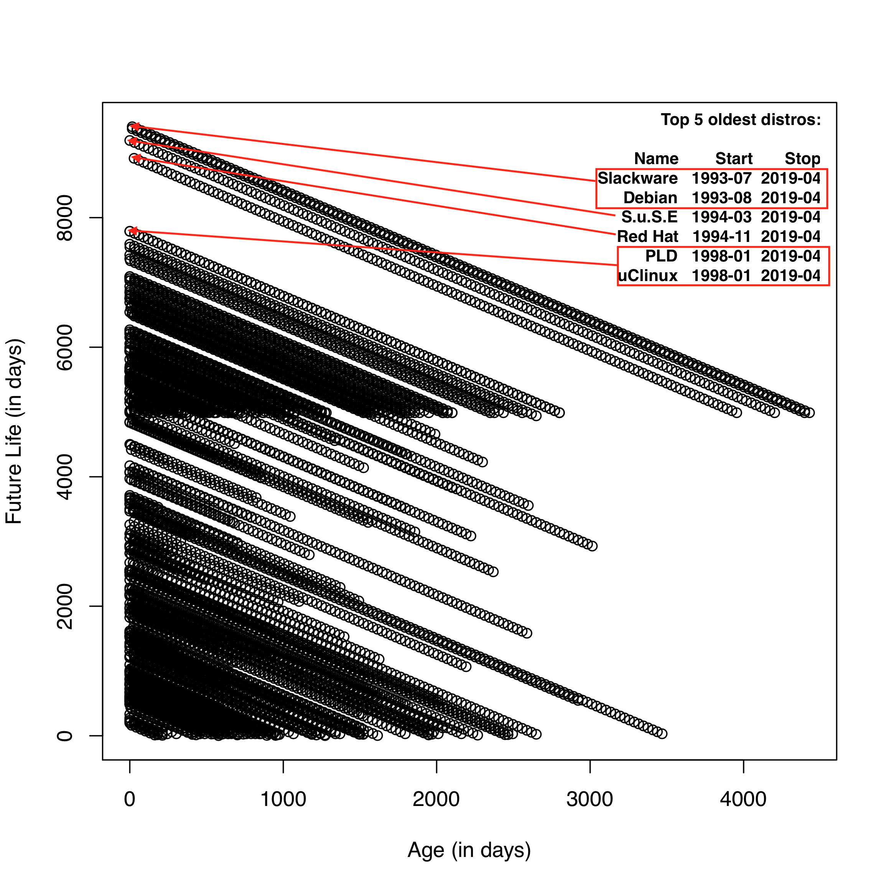

# lindy-effect
Statistical testing of the [Lindy effect](https://en.wikipedia.org/wiki/Lindy_effect) with real world data


## About the experiment

We test the accuracy of the Lindy Effect on the history of GNU/Linux distributions.

The source code of the experiment is here:
[process.R](./process.R)

Table of contents
=================

  * [Steps to reproduce](#steps-to-reproduce)
  * [Results](#results)
  * [Input Data Visualization](#input-data-visualization)
  * [Results Visualization](#results-visualization)
  * [Results Raw Data](#results-raw-data)


## Steps to reproduce

### Prerequisites

1. [Install R 3.6.1](https://github.com/alevchuk/lindy-effect/blob/master/R/README.md)

### Input data

We're using the [2019 May 4 version of FabioLolix/LinuxTimeline data](https://github.com/FabioLolix/LinuxTimeline/commit/28e13cc8f406546a701b6e5c197ee20da58b5d66)

No need to pre-download, the R script will download this file for you.

### Download and run the experiment

Change into the R user account:
```
sudo su -l r
```

Download script:
```
mkdir ~/lindy-effect
cd ~/lindy-effect
curl https://raw.githubusercontent.com/alevchuk/lindy-effect/master/process.R > process.R
chmod +x process.R
```

Run experiment:
```
./process.R
```

## Results

Using lindy effect to predict which Linux distro will live 2x of its current age.
At each time point, we take the oldest repo among survivors and bet that it will live 2x of its current age
then we count the time points when we were correct and calculate what percentage of time we were correct.

| Description | Value |
| ----------- | ----- |
| Time points when correct: | 98 |
| Time points total: | 164 |
| Ratio: | 0.597560975609756 |

Lindy effect is correct 59.8% of the time


## Input Data Visualization

Our input data has a beautiful visualization in the **Linux_distribution wikipedia article** https://en.wikipedia.org/wiki/Linux_distribution#History


# Results Visualization




# Results Raw Data

### Oldest survivors

|       Name  |      Start |       Stop | totalAgeInDays |
| ----------- | ---------- | ---------- | -------------- |
| MCC Interim | 1992-02-01 | 1996-04-23 |      1543 days |
|         DLD | 1993-01-01 | 1999-12-01 |      2525 days |
|   Slackware | 1993-07-16 | 2019-04-30 |      9419 days |


### Time points when prediction was correct
| currentTime        | Name        | ageInDays | futureLifeInDays | willLive2x |
| ------------------ | ----------- | --------- | ---------------- | ---------- |
| 1992-02-01         | MCC Interim |    0 days |        1543 days |      TRUE  |
| 1992-03-01         | MCC Interim |   29 days |        1514 days |      TRUE  |
| 1992-04-01         | MCC Interim |   60 days |        1483 days |      TRUE  |
| 1992-05-01         | MCC Interim |   90 days |        1453 days |      TRUE  |
| 1992-06-01         | MCC Interim |  121 days |        1422 days |      TRUE  |
| 1992-07-01         | MCC Interim |  151 days |        1392 days |      TRUE  |
| 1992-08-01         | MCC Interim |  182 days |        1361 days |      TRUE  |
| 1992-09-01         | MCC Interim |  213 days |        1330 days |      TRUE  |
| 1992-10-01         | MCC Interim |  243 days |        1300 days |      TRUE  |
| 1992-11-01         | MCC Interim |  274 days |        1269 days |      TRUE  |
| 1992-12-01         | MCC Interim |  304 days |        1239 days |      TRUE  |
| 1993-01-01         | MCC Interim |  335 days |        1208 days |      TRUE  |
| 1993-02-01         | MCC Interim |  366 days |        1177 days |      TRUE  |
| 1993-03-01         | MCC Interim |  394 days |        1149 days |      TRUE  |
| 1993-04-01         | MCC Interim |  425 days |        1118 days |      TRUE  |
| 1993-05-01         | MCC Interim |  455 days |        1088 days |      TRUE  |
| 1993-06-01         | MCC Interim |  486 days |        1057 days |      TRUE  |
| 1993-07-01         | MCC Interim |  516 days |        1027 days |      TRUE  |
| 1993-08-01         | MCC Interim |  547 days |         996 days |      TRUE  |
| 1993-09-01         | MCC Interim |  578 days |         965 days |      TRUE  |
| 1993-10-01         | MCC Interim |  608 days |         935 days |      TRUE  |
| 1993-11-01         | MCC Interim |  639 days |         904 days |      TRUE  |
| 1993-12-01         | MCC Interim |  669 days |         874 days |      TRUE  |
| 1994-01-01         | MCC Interim |  700 days |         843 days |      TRUE  |
| 1994-02-01         | MCC Interim |  731 days |         812 days |      TRUE  |
| 1994-03-01         | MCC Interim |  759 days |         784 days |      TRUE  |
| 1994-04-01         | MCC Interim |  790 days |         753 days |     FALSE  |
| 1994-05-01         | MCC Interim |  820 days |         723 days |     FALSE  |
| 1994-06-01         | MCC Interim |  851 days |         692 days |     FALSE  |
| 1994-07-01         | MCC Interim |  881 days |         662 days |     FALSE  |
| 1994-08-01         | MCC Interim |  912 days |         631 days |     FALSE  |
| 1994-09-01         | MCC Interim |  943 days |         600 days |     FALSE  |
| 1994-10-01         | MCC Interim |  973 days |         570 days |     FALSE  |
| 1994-11-01         | MCC Interim | 1004 days |         539 days |     FALSE  |
| 1994-12-01         | MCC Interim | 1034 days |         509 days |     FALSE  |
| 1995-01-01         | MCC Interim | 1065 days |         478 days |     FALSE  |
| 1995-02-01         | MCC Interim | 1096 days |         447 days |     FALSE  |
| 1995-03-01         | MCC Interim | 1124 days |         419 days |     FALSE  |
| 1995-04-01         | MCC Interim | 1155 days |         388 days |     FALSE  |
| 1995-05-01         | MCC Interim | 1185 days |         358 days |     FALSE  |
| 1995-06-01         | MCC Interim | 1216 days |         327 days |     FALSE  |
| 1995-07-01         | MCC Interim | 1246 days |         297 days |     FALSE  |
| 1995-08-01         | MCC Interim | 1277 days |         266 days |     FALSE  |
| 1995-09-01         | MCC Interim | 1308 days |         235 days |     FALSE  |
| 1995-10-01         | MCC Interim | 1338 days |         205 days |     FALSE  |
| 1995-11-01         | MCC Interim | 1369 days |         174 days |     FALSE  |
| 1995-12-01         | MCC Interim | 1399 days |         144 days |     FALSE  |
| 1996-01-01         | MCC Interim | 1430 days |         113 days |     FALSE  |
| 1996-02-01         | MCC Interim | 1461 days |          82 days |     FALSE  |
| 1996-03-01         | MCC Interim | 1490 days |          53 days |     FALSE  |
| 1996-04-01         | MCC Interim | 1521 days |          22 days |     FALSE  |
| 1996-05-01         |         DLD | 1216 days |        1309 days |      TRUE  |
| 1996-06-01         |         DLD | 1247 days |        1278 days |      TRUE  |
| 1996-07-01         |         DLD | 1277 days |        1248 days |     FALSE  |
| 1996-08-01         |         DLD | 1308 days |        1217 days |     FALSE  |
| 1996-09-01         |         DLD | 1339 days |        1186 days |     FALSE  |
| 1996-10-01         |         DLD | 1369 days |        1156 days |     FALSE  |
| 1996-11-01         |         DLD | 1400 days |        1125 days |     FALSE  |
| 1996-12-01         |         DLD | 1430 days |        1095 days |     FALSE  |
| 1997-01-01         |         DLD | 1461 days |        1064 days |     FALSE  |
| 1997-02-01         |         DLD | 1492 days |        1033 days |     FALSE  |
| 1997-03-01         |         DLD | 1520 days |        1005 days |     FALSE  |
| 1997-04-01         |         DLD | 1551 days |         974 days |     FALSE  |
| 1997-05-01         |         DLD | 1581 days |         944 days |     FALSE  |
| 1997-06-01         |         DLD | 1612 days |         913 days |     FALSE  |
| 1997-07-01         |         DLD | 1642 days |         883 days |     FALSE  |
| 1997-08-01         |         DLD | 1673 days |         852 days |     FALSE  |
| 1997-09-01         |         DLD | 1704 days |         821 days |     FALSE  |
| 1997-10-01         |         DLD | 1734 days |         791 days |     FALSE  |
| 1997-11-01         |         DLD | 1765 days |         760 days |     FALSE  |
| 1997-12-01         |         DLD | 1795 days |         730 days |     FALSE  |
| 1998-01-01         |         DLD | 1826 days |         699 days |     FALSE  |
| 1998-02-01         |         DLD | 1857 days |         668 days |     FALSE  |
| 1998-03-01         |         DLD | 1885 days |         640 days |     FALSE  |
| 1998-04-01         |         DLD | 1916 days |         609 days |     FALSE  |
| 1998-05-01         |         DLD | 1946 days |         579 days |     FALSE  |
| 1998-06-01         |         DLD | 1977 days |         548 days |     FALSE  |
| 1998-07-01         |         DLD | 2007 days |         518 days |     FALSE  |
| 1998-08-01         |         DLD | 2038 days |         487 days |     FALSE  |
| 1998-09-01         |         DLD | 2069 days |         456 days |     FALSE  |
| 1998-10-01         |         DLD | 2099 days |         426 days |     FALSE  |
| 1998-11-01         |         DLD | 2130 days |         395 days |     FALSE  |
| 1998-12-01         |         DLD | 2160 days |         365 days |     FALSE  |
| 1999-01-01         |         DLD | 2191 days |         334 days |     FALSE  |
| 1999-02-01         |         DLD | 2222 days |         303 days |     FALSE  |
| 1999-03-01         |         DLD | 2250 days |         275 days |     FALSE  |
| 1999-04-01         |         DLD | 2281 days |         244 days |     FALSE  |
| 1999-05-01         |         DLD | 2311 days |         214 days |     FALSE  |
| 1999-06-01         |         DLD | 2342 days |         183 days |     FALSE  |
| 1999-07-01         |         DLD | 2372 days |         153 days |     FALSE  |
| 1999-08-01         |         DLD | 2403 days |         122 days |     FALSE  |
| 1999-09-01         |         DLD | 2434 days |          91 days |     FALSE  |
| 1999-10-01         |         DLD | 2464 days |          61 days |     FALSE  |
| 1999-11-01         |         DLD | 2495 days |          30 days |     FALSE  |
| 1999-12-01         |   Slackware | 2329 days |        7090 days |      TRUE  |
| 2000-01-01         |   Slackware | 2360 days |        7059 days |      TRUE  |
| 2000-02-01         |   Slackware | 2391 days |        7028 days |      TRUE  |
| 2000-03-01         |   Slackware | 2420 days |        6999 days |      TRUE  |
| 2000-04-01         |   Slackware | 2451 days |        6968 days |      TRUE  |
| 2000-05-01         |   Slackware | 2481 days |        6938 days |      TRUE  |
| 2000-06-01         |   Slackware | 2512 days |        6907 days |      TRUE  |
| 2000-07-01         |   Slackware | 2542 days |        6877 days |      TRUE  |
| 2000-08-01         |   Slackware | 2573 days |        6846 days |      TRUE  |
| 2000-09-01         |   Slackware | 2604 days |        6815 days |      TRUE  |
| 2000-10-01         |   Slackware | 2634 days |        6785 days |      TRUE  |
| 2000-11-01         |   Slackware | 2665 days |        6754 days |      TRUE  |
| 2000-12-01         |   Slackware | 2695 days |        6724 days |      TRUE  |
| 2001-01-01         |   Slackware | 2726 days |        6693 days |      TRUE  |
| 2001-02-01         |   Slackware | 2757 days |        6662 days |      TRUE  |
| 2001-03-01         |   Slackware | 2785 days |        6634 days |      TRUE  |
| 2001-04-01         |   Slackware | 2816 days |        6603 days |      TRUE  |
| 2001-05-01         |   Slackware | 2846 days |        6573 days |      TRUE  |
| 2001-06-01         |   Slackware | 2877 days |        6542 days |      TRUE  |
| 2001-07-01         |   Slackware | 2907 days |        6512 days |      TRUE  |
| 2001-08-01         |   Slackware | 2938 days |        6481 days |      TRUE  |
| 2001-09-01         |   Slackware | 2969 days |        6450 days |      TRUE  |
| 2001-10-01         |   Slackware | 2999 days |        6420 days |      TRUE  |
| 2001-11-01         |   Slackware | 3030 days |        6389 days |      TRUE  |
| 2001-12-01         |   Slackware | 3060 days |        6359 days |      TRUE  |
| 2002-01-01         |   Slackware | 3091 days |        6328 days |      TRUE  |
| 2002-02-01         |   Slackware | 3122 days |        6297 days |      TRUE  |
| 2002-03-01         |   Slackware | 3150 days |        6269 days |      TRUE  |
| 2002-04-01         |   Slackware | 3181 days |        6238 days |      TRUE  |
| 2002-05-01         |   Slackware | 3211 days |        6208 days |      TRUE  |
| 2002-06-01         |   Slackware | 3242 days |        6177 days |      TRUE  |
| 2002-07-01         |   Slackware | 3272 days |        6147 days |      TRUE  |
| 2002-08-01         |   Slackware | 3303 days |        6116 days |      TRUE  |
| 2002-09-01         |   Slackware | 3334 days |        6085 days |      TRUE  |
| 2002-10-01         |   Slackware | 3364 days |        6055 days |      TRUE  |
| 2002-11-01         |   Slackware | 3395 days |        6024 days |      TRUE  |
| 2002-12-01         |   Slackware | 3425 days |        5994 days |      TRUE  |
| 2003-01-01         |   Slackware | 3456 days |        5963 days |      TRUE  |
| 2003-02-01         |   Slackware | 3487 days |        5932 days |      TRUE  |
| 2003-03-01         |   Slackware | 3515 days |        5904 days |      TRUE  |
| 2003-04-01         |   Slackware | 3546 days |        5873 days |      TRUE  |
| 2003-05-01         |   Slackware | 3576 days |        5843 days |      TRUE  |
| 2003-06-01         |   Slackware | 3607 days |        5812 days |      TRUE  |
| 2003-07-01         |   Slackware | 3637 days |        5782 days |      TRUE  |
| 2003-08-01         |   Slackware | 3668 days |        5751 days |      TRUE  |
| 2003-09-01         |   Slackware | 3699 days |        5720 days |      TRUE  |
| 2003-10-01         |   Slackware | 3729 days |        5690 days |      TRUE  |
| 2003-11-01         |   Slackware | 3760 days |        5659 days |      TRUE  |
| 2003-12-01         |   Slackware | 3790 days |        5629 days |      TRUE  |
| 2004-01-01         |   Slackware | 3821 days |        5598 days |      TRUE  |
| 2004-02-01         |   Slackware | 3852 days |        5567 days |      TRUE  |
| 2004-03-01         |   Slackware | 3881 days |        5538 days |      TRUE  |
| 2004-04-01         |   Slackware | 3912 days |        5507 days |      TRUE  |
| 2004-05-01         |   Slackware | 3942 days |        5477 days |      TRUE  |
| 2004-06-01         |   Slackware | 3973 days |        5446 days |      TRUE  |
| 2004-07-01         |   Slackware | 4003 days |        5416 days |      TRUE  |
| 2004-08-01         |   Slackware | 4034 days |        5385 days |      TRUE  |
| 2004-09-01         |   Slackware | 4065 days |        5354 days |      TRUE  |
| 2004-10-01         |   Slackware | 4095 days |        5324 days |      TRUE  |
| 2004-11-01         |   Slackware | 4126 days |        5293 days |      TRUE  |
| 2004-12-01         |   Slackware | 4156 days |        5263 days |      TRUE  |
| 2005-01-01         |   Slackware | 4187 days |        5232 days |      TRUE  |
| 2005-02-01         |   Slackware | 4218 days |        5201 days |      TRUE  |
| 2005-03-01         |   Slackware | 4246 days |        5173 days |      TRUE  |
| 2005-04-01         |   Slackware | 4277 days |        5142 days |      TRUE  |
| 2005-05-01         |   Slackware | 4307 days |        5112 days |      TRUE  |
| 2005-06-01         |   Slackware | 4338 days |        5081 days |      TRUE  |
| 2005-07-01         |   Slackware | 4368 days |        5051 days |      TRUE  |
| 2005-08-01         |   Slackware | 4399 days |        5020 days |      TRUE  |
| 2005-09-01         |   Slackware | 4430 days |        4989 days |      TRUE  |
