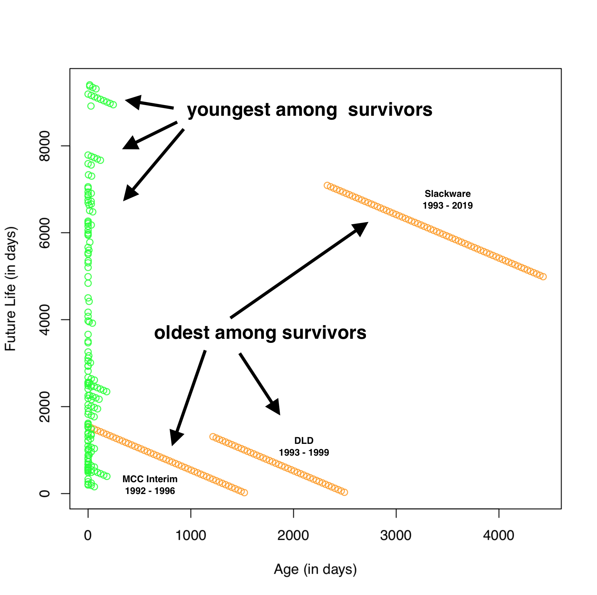

# lindy-effect
Statistical testing of the [Lindy effect](https://en.wikipedia.org/wiki/Lindy_effect) with real world data


## About the experiment

We test the accuracy of the Lindy Effect on the history of GNU/Linux distributions.

The source code of the experiment is here:
[process.R](./process.R)


## Steps to reproduce

### Prerequisites
1. [Get hardware that can run Linux](https://github.com/alevchuk/minibank/blob/master/README.md#model-4--node-at-home)
2. [Install Debian 10 "buster"](https://github.com/alevchuk/minibank/blob/master/README.md#operating-system)
3. [Install R](https://github.com/alevchuk/lindy-effect/blob/master/R/README.md)

### Source data

We're using the [2019 May 4 version of FabioLolix/LinuxTimeline data](https://github.com/FabioLolix/LinuxTimeline/commit/28e13cc8f406546a701b6e5c197ee20da58b5d66)

No need to pre-download, the R script will download this file for you.

### Download and run the experiment

Change into the R user account:
```
sudo su -l r
```

Download script:
```
cd ~/lindy-data
curl https://raw.githubusercontent.com/alevchuk/lindy-effect/master/process.R > process.R
chmod +x process.R
```

Run experiment:
```
./process.R
```

## Visualization of the input data

Our input data has a beautiful visualization in the **Linux_distribution wikipedia article** https://en.wikipedia.org/wiki/Linux_distribution#History


# Results



